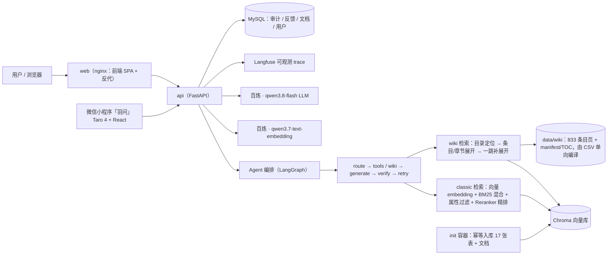

# badminton-rag · 羽毛球知识库问答系统

> 基于 **Agentic RAG** 架构的羽毛球领域知识问答系统：LangGraph 路由/工具/校验编排 + 混合检索（向量 + BM25）+ 重排序 + **LLM Wiki 导航式检索** + 四指标评测闭环 + Langfuse 全链路可观测 + Docker Compose 一键部署 + **Web 聊天/管理端 与 微信小程序「羽问」双客户端**。

[](tests/) · [](计划文档/badminton-rag-roadmap.md)

---

## 架构图



**一键部署**：`docker compose up -d --build` → 新环境 **5 分钟内可提问**（浏览器打开 `http://localhost:8080`）。

---

## 功能亮点（Phase 0~10 + 11 / Wiki 进行中）

| 阶段 | 能力 | 验收数据 |
|---|---|---|
| P0~1 | 文档接入 + 混合检索（向量+BM25）+ 重排序 + 引用溯源 | 检索候选池覆盖 17 张表 |
| P2 | 企业级底座：审计日志 / 限流 / 管理后台 / 统一错误码 | API 层全量测试 |
| P3 | **Agentic RAG**：五类路由 + 工具调用 + 多轮记忆 + 回答校验 | 20 题多跳通过率 **90%**（在线 repeat=3） |
| P4 | **评测闭环 + 可观测**：LLM-as-judge 四指标 / Langfuse trace / FAQ 缓存 / 成本统计 / bad case 反哺 | 221 测试全绿 |
| P5 | **部署与展示**：Docker Compose 一键起 + 精致聊天 UI + README 简历化 | 新环境 5 分钟可提问 |
| P6 | **文档/图片入库**：PDF（PyMuPDF）+ 图片（RapidOCR / SiliconFlow 多模态索引）+ document 路由 + 管理端上传/文档管理 | 254 测试全绿 |
| P7 | **双角色账户与 RBAC**：用户/管理员登录、模块级权限、种子管理员 | 严格管理员端点测试 |
| P8 | **用户端功能**：范围限定/语音/历史/收藏/目录/动态/纠错/通知 | 用户端 API 10 例 |
| P9 | **双数据库后端**：自动建库 + DDL 方言转换（当前默认后端为 MySQL，详见「数据库」小节） | MySQL 真实链路验证 |
| P10 | **管理端后台**：总览 Dashboard/健康探活、知识库打标、RAG 调优（沙箱/参数/Prompt/词典）、审核工单、模块权限导航、系统只读 | 326 测试全绿 |
| P11 | **微信小程序「羽问」**（进行中）：微信一键登录 / 手机号绑定与解绑、10 页完整功能、内容安全 msgSecCheck、订阅消息、tabBar 图标、提审清单（**个人主体合规：不提供球友动态等 UGC 社交模块**） | W1~W4 完成；真机 golden 走查 `agent_result_w4.json` |
| W | **LLM Wiki 模式**（进行中）：离线编译条目页 + 在线导航式检索 + 请求级 mode 切换 + 沙箱回放 + classic/wiki 并排 A/B | A/B strict precision **0.494 → 0.726**（W3 基线，见评测第 5 节） |

---

## 快速开始

### 方式一：Docker Compose 一键起（推荐演示）

```bash
# 1. 准备 .env（复制模板并填密钥：百炼 LLM_API_KEY 必填）
cp .env.example .env

# 2. 一键启动（首次自动：校验 key → 重建向量库 → 起 API + Web）
docker compose up -d --build

# 3. 打开浏览器
#    http://localhost:8080   聊天 UI
#    http://localhost:8000/docs  OpenAPI 文档
```

- 首次启动 5 分钟内可提问（含入库，810 条知识：5 张规格表 695 行 + 12 张知识表 115 行）；
- 停止 `docker compose down`（数据卷保留）；可选自托管 Langfuse：`docker compose --profile selfhost up -d`；
- Wiki 导航检索需要编译产物（见「LLM Wiki 模式」小节），**新环境未编译时自动以 classic 模式运行，行为与 Phase 10 一致**。

### 方式二：本地开发

```bash
# 后端（入库与问答都调百炼 API，需 .env 配置 LLM_API_KEY）
.venv/Scripts/python.exe -m pip install -r requirements.txt
.venv/Scripts/python.exe -m app.ingest.pipeline      # 全量重建向量库
.venv/Scripts/python.exe -m uvicorn main:app --reload

# 前端（vite dev，proxy 转发到 8000）
cd web && npm install && npm run dev                 # http://localhost:5173

# 微信小程序（Taro 4；watch 编译产物 mp/dist，微信开发者工具导入 mp/ 目录）
cd mp && npm install && npm run dev:weapp
```

---

## 评测报告（Phase 4）

### 1. Agent 通过率（20 题多跳，在线 repeat=3）

**18 / 20 = 90%**（2026-08-29 重跑，百炼 `qwen3.8-flash` + `qwen3.7-text-embedding`，在线 repeat=3）。

失败集中在 a14/a15 两道 **multi 拆解题**：同一题 3 次里有 2 次 generate 节点在合并后的上下文上判「依据不足」整答兜底，剩下 1 次答案完整正确（a14 还叠加路由抖动：走 `equipment` 那次通过、走 `multi` 两次兜底）。已列入 bad case 改进项；此前记录的「唯一稳定失败 a06」本轮 2/3 通过，不再成立。

### 2. 四指标在线基线（LLM-as-judge，上下文 = agent 真实喂给生成节点的 `state["contexts"]`）

| 指标 | 平均 | 说明 |
|---|---|---|
| faithfulness | **0.812** | 回答主张能被上下文支撑的比例 |
| answer_relevancy | **0.873** | 回答切题、信息充分度 |
| context_precision | **0.407** | 检索条目中相关条目占比（**主要短板**） |
| context_recall | **0.675** | 标准答案信息点被上下文覆盖的比例 |

**按 route 分组**：

| route | faith | relev | prec | recall |
|---|---|---|---|---|
| rules | 1.000 | 1.000 | 0.375 | 1.000 |
| technique | 0.963 | 0.917 | 0.467 | 0.600 |
| equipment | 0.944 | 0.917 | **0.574** | 0.611 |
| multi | 0.733 | 0.842 | **0.356** | 0.683 |

> 关键结论：**equipment 路由的 context_precision 最高（0.574）**，证明「路由 + 定向检索」相比全表检索更精准；multi 路由拆解后上下文最嘈杂（0.356），是下一步优化重点（子问题分组截断 + retry 后重排）——Wiki 导航检索正是针对这一短板的路线。

### 3. 可观测（Langfuse v4）

每次 `/chat` 请求一条完整 trace：`route → 工具 → generate → verify`，每个节点记录**耗时 + token**，根 observation 承载整体输入/输出（`POST /chat` 响应带 `trace_id` 与 `langfuse_url`，前端一键跳转）。

### 4. Bad Case 复盘

`scripts/collect_bad_cases.py` 按 **router / retrieval / faithfulness / relevancy / data / feedback** 六类生成 `data/eval/bad_cases.md`（标注根因与改进方向，管理后台静态渲染），`POST /feedback` 点踩记录自动并入闭环。

### 5. Wiki vs classic 并排 A/B（W3 基线，2026-08-28）

20 题 golden / repeat=2 / 同 judge 同库同 seed（`data/eval/wiki_comparison.json`）：

| 指标 | classic | wiki | Δ |
|---|---|---|---|
| `context_precision_strict` | 0.494 | **0.726** | **+0.232** |
| `context_precision` | 0.489 | 0.690 | +0.200 |
| `token_efficiency` | 0.483 | 0.715 | +0.231 |
| faithfulness | 0.778 | 0.871 | +0.093 |
| answer_relevancy | 0.831 | 0.838 | +0.006 |
| context_recall | 0.527 | 0.513 | −0.014 |
| 平均 context 条数 | 11.95 | **8.95** | −3.00 |

0 题降级 classic：更少的上下文换来了显著更高的精准度与忠实度。
> 口径说明：本表为 W4「category 聚合条目」上线**之前**的测量；W4 首轮测量存在锚点口径缺陷（已修复），其数字作废，category 是否净收益待全量重跑 `eval_agent_quality --mode both` 后定论。

---

## 目录结构

```
badminton-rag/
├── app/
│   ├── api/routes/       # FastAPI 路由（/chat /ask /feedback /auth* /user* /kb /admin* /audit）
│   ├── agent/            # LangGraph 编排（路由/工具/记忆/校验）
│   ├── rag/              # 混合检索 + 重排 + 查询改写 + 沙箱调试回放
│   ├── wiki/             # LLM Wiki：模板编译器 / manifest+TOC / 向量索引 / 在线导航器
│   ├── ingest/           # 入库流水线（CSV 全量+增量同步 + PDF/图片/文本文档 + OCR + 多模态）
│   ├── security/         # 微信开放能力（msgSecCheck 内容安全 / 订阅消息）
│   ├── observability/    # Tracer（Langfuse v4 / Null）/ FAQ 缓存 / token 统计
│   └── core/             # 配置 / 日志 / 限流 / 令牌与口令散列
├── web/                  # 前端（Vite + React + TS：登录 / 用户端 4 Tab / 管理端 6 模块）
├── mp/                   # 微信小程序「羽问」（Taro 4.1.8 + React + TS + Sass，10 页）
├── mp-prototype/         # 小程序高保真原型（6 屏 375×812）
├── scripts/              # 评测 / wiki 编译 / bad case / Langfuse 验证脚本
├── data/                 # raw / processed / raw_docs / chroma / wiki / eval / uploads
├── tests/                # 447 个测试（全部离线，不触网）
├── 计划文档/              # roadmap / 各阶段设计与计划 / 小程序提审清单
├── Dockerfile            # API 镜像（python:3.12-slim）
├── docker-compose.yml    # mysql + init + api + web（自托管 Langfuse 仍在 profile 下）
├── deploy/nginx.conf     # web 反代配置（含 client_max_body_size）
└── .env.example          # 环境变量模板
```

## API 一览

| 方法 | 路径 | 说明 |
|---|---|---|
| POST | `/auth/register` | 注册（默认角色 user），返回 token + 用户信息 |
| POST | `/auth/login` | 登录（用户/管理员统一入口），Bearer token |
| POST | `/auth/wechat` | **小程序一键登录**（code2session → openid 自动建号/复用，响应带 `is_new`） |
| POST | `/auth/wechat/phone` | 绑定微信手机号（getuserphonenumber；已被他人绑定 → 409） |
| POST | `/auth/unbind` | 解绑微信登录或手机号 |
| GET/PATCH | `/auth/me` `/auth/profile` | 当前用户 / 更新资料与偏好（头像/昵称/性别/水平/球拍/语气/引用） |
| POST | `/chat` | Agentic 对话（路由/工具/记忆/校验），支持 `scope` 范围限定与 `mode`（classic\|wiki）；登录自动存会话；响应带 `mode` + `wiki_trace` |
| POST | `/ask` | 朴素 RAG 问答（登录可选） |
| POST | `/feedback` | 点赞/点踩（进 bad case 闭环；登录用户自动关联 user_id） |
| GET | `/kb/overview` | 知识库统计（公开只读）；`/kb/catalog` 已废弃（页面不再展示） |
| GET/POST/PATCH/DELETE | `/user/conversations` | 历史对话记录（搜索/标签/收藏/重命名/删除/详情回放） |
| GET/POST/PATCH/DELETE | `/user/favorites` `/user/folders` | 收藏夹与文件夹（移动分类） |
| GET/POST | `/user/posts` | 球友动态（文本+图片，带已赞状态/回复数）与发布（UGC 经 msgSecCheck 守卫） |
| POST | `/user/posts/{id}/like` | 点赞动态（再点取消；每用户每条限 1 次） |
| GET/POST | `/user/posts/{id}/replies` | 动态回复列表（楼中楼）/ 回复动态（可回复他人的回复） |
| POST | `/user/replies/{id}/like` | 点赞回复（再点取消；每用户每条限 1 次） |
| GET | `/user/hot` | 热门问答排行（赞 + 收藏聚合） |
| POST/GET | `/user/corrections` | 内容纠错提交 / 我的纠错 |
| GET/POST | `/user/notifications` `/user/notifications/read` | 消息通知列表 / 全部或部分已读 |
| POST | `/user/uploads` | 动态配图上传（≤2MB，返回 `/uploads/xxx`） |
| GET | `/chat/stats` | 成本报表（管理员 JWT，兼容旧 X-Admin-Key） |
| GET/POST/DELETE | `/admin/documents` | 文档上传（txt/md/csv/pdf/图片）/列表/删除/重索引（管理员 JWT，兼容旧 X-Admin-Key） |
| GET/PATCH | `/admin/users` | 用户与权限管理：列表 / 改角色 / 禁用 / 模块权限（**严格管理员 JWT**，旧 key 不可用） |
| GET | `/admin/dashboard` | 知识库总览：文档/向量/消息/用户统计、待办提醒、成本报表（`require_admin_module("dashboard")`） |
| GET | `/admin/health` | 组件健康探活：DB / Chroma / 百炼（LLM+embedding） / SiliconFlow |
| GET/PUT | `/admin/rag/settings` | RAG 运行时参数：`vector_top_k` / `filter_top_k` / `rerank_enabled` / `blacklist_enabled` |
| GET/POST/PUT/DELETE | `/admin/rag/prompts` | Prompt 模板 CRUD + `POST .../{id}/activate` 激活（变更即重建 Agent） |
| GET/POST/DELETE | `/admin/rag/synonyms` `/admin/rag/blacklist` | 同义词组 / 敏感词词典（变更即重建 Agent） |
| POST | `/admin/rag/debug` | **RAG 沙箱**：链路回放（路由→扩展查询→候选块→过滤→上下文→回答），`with_answer=false` 免 LLM；`mode=wiki` 走导航链路（候选带 origin + `wiki_trace`） |
| GET/PATCH | `/admin/corrections` | 纠错工单（状态筛选）；采纳即通知提交者 + 微信订阅消息（旁路）；rejected/discussion 仅落状态 |
| GET | `/admin/qc/bad` | 低质量问答聚合（点踩按问题统计） |
| GET | `/admin/system` | 系统配置只读（模型/限流/上传/库，密钥掩码） |
| PATCH | `/admin/documents/{id}/tags` | 文档打标（DB + Chroma 元数据同步，不重嵌） |
| GET | `/audit` | 审计日志（管理员 JWT，兼容旧 X-Admin-Key） |
| GET | `/health` | 存活探针 |

## 配置（.env）

| 变量 | 说明 |
|---|---|
| `DB_BACKEND` | 数据库后端：`mysql`（默认）或 `sqlite`（仅离线测试，由 `tests/conftest.py` 强制，无需手工配） |
| `MYSQL_HOST` / `MYSQL_PORT` / `MYSQL_USER` / `MYSQL_PASSWORD` / `MYSQL_DB` | MySQL 连接配置（默认后端所需；库不存在时启动自动创建） |
| `LLM_API_KEY` | 百炼 DashScope key：生成 LLM 与文本 embedding 共用（必填） |
| `LLM_BASE_URL` / `LLM_MODEL` | 生成端点与模型（默认百炼 compatible-mode / `qwen3.8-flash`） |
| `EMBEDDING_MODEL` | 文本 embedding 模型（默认 `qwen3.7-text-embedding`）；改这一项必须全量重索引 |
| `RERANK_API_KEY` / `ASK_USE_RERANK` | 可选精排（SiliconFlow bge-reranker） |
| `VISION_EMBED_ENABLED` / `VISION_API_KEY` | 无文字图片的多模态索引（SiliconFlow Qwen3-VL-Embedding，key 缺省复用 `RERANK_API_KEY`） |
| `LANGFUSE_ENABLED` / `LANGFUSE_*` | 可观测开关（默认 false，不依赖） |
| `WIKI_MODE_ENABLED` | LLM Wiki 导航检索总开关（默认 true；未编译/产物落后于 CSV 时自动回落 classic） |
| `WIKI_MAX_STEPS` / `WIKI_DIR` | Wiki 补展开轮数上限（默认 3）/ 派生目录（默认 `data/wiki`） |
| `ADMIN_API_KEY` | 旧版管理共享密钥（向后兼容，可留空） |
| `AUTH_TOKEN_SECRET` | 会话令牌签名密钥（生产必改） |
| `AUTH_TOKEN_TTL` | 令牌有效期秒数（默认 604800 = 7 天） |
| `BOOTSTRAP_ADMIN_USERNAME` / `BOOTSTRAP_ADMIN_PASSWORD` | 启动时自动创建的管理员种子账号（可留空） |
| `WX_APPID` / `WX_SECRET` | 微信小程序登录凭证（留空则 `/auth/wechat` 显式报错，其余功能不受影响） |
| `WX_SUBSCRIBE_TEMPLATE_ID` | 纠错采纳订阅消息模板 id（留空不发送） |

### 数据库：MySQL（默认）与 SQLite（仅测试）

- **MySQL（默认）**：`.env` 配 `MYSQL_*` 即可；业务表自动**建库**（库不存在时 `CREATE DATABASE IF NOT EXISTS`，账号需有 CREATE 权限）+ 建表/迁移（utf8mb4，DDL 方言差异由 `app/db/database.py` 透明转换）。本机 MySQL 直接跑：
  ```bash
  # .env：DB_BACKEND=mysql + MYSQL_HOST/USER/PASSWORD/DB
  .venv/Scripts/python.exe -m uvicorn main:app --port 8000
  ```
- **SQLite（仅离线测试）**：`tests/conftest.py` 顶层强制 `DB_BACKEND=sqlite` 并把 `db_path` 指向每个测试自己的临时文件，因此 `pytest` 既不触网也绝不写入真实业务库——本机 `.env` 开着 MySQL 也不影响。日常开发不需要手工配 sqlite。
- **Docker Compose**：`mysql:8.0` 已是默认服务，随 `docker compose up -d --build` 一起起（数据卷 `mysql-data`），不再需要 `--profile mysql`。
  ```bash
  docker compose up -d --build     # mysql + init 建表入库 + api + web
  ```
  注意：MySQL 与 SQLite 两套数据不互通，切换后端后用户/会话等业务数据从空库开始；向量库（Chroma）与业务库相互独立，不受切换影响。仓库里原先的 `data/app.db`（SQLite 旧副本）已退役移出项目，业务数据以 MySQL 的 `badminton` 库为准。

## 测试

```bash
.venv/Scripts/python.exe -m pytest -q    # 447 passed，全部离线（不触网）
```

## 数据入库：全量 / 增量 / 文档（Phase 1~6）

```bash
# 全量重建向量库（17 张 CSV → data/chroma，行主键 id + digest 幂等）
.venv/Scripts/python.exe -m app.ingest.pipeline

# 增量同步（日常推荐）：只重嵌内容变化的行、自动删除陈旧行
.venv/Scripts/python.exe -m app.ingest.pipeline --sync
.venv/Scripts/python.exe -m app.ingest.pipeline --sync --tables 球拍,羽毛球   # 限定表名

# 文档/图片批量入库（data/raw_docs 下放 PDF/图片/txt/md/csv，按文件 hash 幂等）
.venv/Scripts/python.exe -m app.ingest.pipeline --dir data/raw_docs
# 或只入文档（跳过 17 张 CSV）
.venv/Scripts/python.exe -m app.ingest.pipeline --only-docs
```

- **PDF**：PyMuPDF 解析文字层 + 表格（`find_tables` 转「表头:值」），chunk 带页码；电子版 PDF 入库后 `/chat` 问文档内容会路由到 `document` 并引用文件名/页码。
- **图片**：RapidOCR 提取文字（CPU 离线）入库，可被文字检索命中；**无文字插画走多模态图片索引**（SiliconFlow `Qwen/Qwen3-VL-Embedding-8B`，图片+文本同空间 4096 维，按图检索），需在 `.env` 开 `VISION_EMBED_ENABLED=true`（key 缺省复用 `RERANK_API_KEY`）。
- **管理端**：`#/admin` 用管理员账户登录（种子账号见 `BOOTSTRAP_ADMIN_*`，或后台分配），左侧导航 6 模块：📊 知识库总览（指标卡/健康探活/成本报表）、📚 知识库管理（上传/列表/打标）、🧪 检索调优（RAG 沙箱/运行时参数/Prompt 模板/同义词与敏感词）、⚖️ 内容审核（纠错工单/低质量聚合 + Bad Case 复盘）、👥 用户与权限（角色/启停/模块权限/审计日志）、⚙️ 系统设置（只读）。模块权限：`users.permissions` 为 NULL=全部、空数组=无、列表=仅所列模块（用户与权限对所有管理员可见）。旧 `ADMIN_API_KEY` 仍兼容文档/审计端点。

## LLM Wiki 模式：离线编译 + 在线导航检索（W1~W4，进行中）

把检索从「相似度 top-k 句子投票」升级为「离线编译 Wiki + 在线 LLM 导航」：

- **编译**（纯模板零 LLM，幂等）：`data/processed/` 810 行 → `data/wiki/` **833 个条目页**（product 695 / concept 71 / category 67），每条记录被且仅被一个主条目锚定、非空单元格逐字可回溯——`validate_entries()` 是忠实性闸门，违反即编译失败。CSV 一行变化只重写该页。
- **索引**：`wiki_page`（条目概况）+ `wiki_section`（章节全文）两个 collection 写入 Chroma（约 3.5k 段，按 digest 增量重嵌）。
- **在线导航**：目录两级漏斗定位（LLM 选分类 → 选条目，向量兜粗排）→ 章节展开 → 至多 `WIKI_MAX_STEPS` 轮**一跳链接补展开**；产出与 classic 同构的上下文，verify/来源/图片/trace 全链路不分叉；未取到知识单元自动回落该路由的 classic 检索并在 `wiki_trace.degraded` 记原因。
- **切换**：全局 `WIKI_MODE_ENABLED`（默认开，可被管理端运行时覆盖）+ 请求级 `POST /chat {"mode": "wiki"}`；管理端 RAG 沙箱 `mode=wiki` 可回放每个候选的 `origin`（orient/step）与完整导航轨迹。

```bash
.venv/Scripts/python.exe -m scripts.build_wiki --skip-llm    # 只编译（重写变化的页）
.venv/Scripts/python.exe -m scripts.build_wiki --index       # 编译 + 嵌入 wiki 集合（需百炼 key）
.venv/Scripts/python.exe -m scripts.build_wiki --check       # 校验 wiki 是否落后于 CSV
# A/B：在线并排对比两模式四指标 + strict precision + token 效率
.venv/Scripts/python.exe -m scripts.eval_agent_quality --online --mode both --repeat 2
```

## 微信小程序「羽问」（Phase 11，进行中）

`mp/`（Taro 4.1.8 + React18 + TS + Sass，设计稿 750 全 rpx）：10 页覆盖登录 / 聊天（打字机、引用面板、赞踩收藏、分享海报；输入区布局对齐 Web 端：预设胶囊 + 范围下拉同行）/ 发现（热门问答）/ 工作台（会话+收藏夹）/ 我的与设置 / 会话详情 / 通知 / 纠错（订阅消息）/ 问答分享详情等。

- **个人主体合规**：微信小程序个人主体不开放社交-图库/资讯等 UGC 社区类目，**发现页「球友动态」模块与发布动态、动态详情页已整体移除**（页面注册、API 封装、样式一并清理）；后端 `/user/posts*` 与 H5 端不受影响，仅小程序端不再露出入口。
- **登录链路**：`POST /auth/wechat` code2session → openid 自动建号（用户名 `wx_{openid前29}`、禁密码登录）→ 签发既有 Bearer token；手机号绑定（同手机号不自动合并、冲突 409）与解绑。
- **内容安全**：小程序侧提交的 UGC 文本（纠错）过 `msgSecCheck` v2（违规 422）；纠错采纳后经订阅消息推送提交者（模板 id 留空不发送）。全部微信开放能力配置门控、探针可注入、测试离线（动态/回复守卫保留在后端供 H5 端使用）。
- **开发**：`cd mp && npm install && npm run dev:weapp`（watch 编译到 `mp/dist`），微信开发者工具导入 `mp/` 目录（开发用 appid `touristappid` + 关闭域名校验）。
- **上线冲刺**：见 [`计划文档/小程序提审清单.md`](计划文档/小程序提审清单.md)（类目 / 备案 / 隐私 / 审核驳回点 / 真机 golden 走查步骤）；`API_BASE_URL` 需换成已备案 HTTPS 域名并在微信后台配置合法域名。

## 演示视频

📹 30~60s 演示视频：*占位（录屏：compose up → 提问 → 引用溯源 → 缓存秒回 → Langfuse trace → 管理页报表）*

---

## License

MIT（仅学习展示；语料不随仓库分发）
